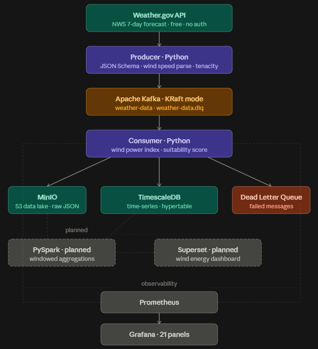

# weather-streaming

A production-grade real-time data streaming pipeline that ingests weather forecast data from the [National Weather Service API](https://weather.gov), publishes it to Apache Kafka, stores raw data in MinIO, persists structured data in TimescaleDB, and exposes full observability through Prometheus and Grafana. Built to demonstrate professional data engineering patterns including event-driven architecture, wind energy production forecasting, containerized microservices, and metrics-driven monitoring.

---

## Architecture

## Architecture



---

## Tech Stack

| Layer | Technology | Purpose |
|---|---|---|
| Message Broker | Apache Kafka 7.6 (KRaft) | Event streaming without Zookeeper |
| Producer | Python + kafka-python-ng | Fetches API data, publishes to Kafka |
| Consumer | Python + kafka-python-ng | Reads messages, writes to MinIO and TimescaleDB |
| Data Lake | MinIO (S3-compatible) | Raw JSON message storage, partitioned by time |
| Time-series DB | TimescaleDB (PostgreSQL) | Structured weather data with wind energy metrics |
| Schema Validation | jsonschema | Validates message format before publishing |
| Retry | tenacity | Exponential backoff for API and Kafka failures |
| Dead Letter Queue | Kafka topic | Failed messages stored for inspection |
| Metrics | Prometheus | Scrapes and stores metrics from all services |
| Dashboards | Grafana 9.5 | Visualizes pipeline health and performance |
| Broker Metrics | JMX Exporter | Exposes Kafka internal JMX metrics to Prometheus |
| Host Metrics | Node Exporter | CPU, memory, disk of the host machine |
| Container Metrics | cAdvisor | Per-container resource usage |
| Broker UI | Kafka UI | Inspect topics, partitions, consumer groups |
| Logging | python-json-logger | Structured JSON logs for all services |
| Config | python-dotenv | Environment-based configuration |
| Testing | pytest + pytest-mock | 38 unit tests |
| CI | GitHub Actions | Lint (ruff) + test on every push |
| Orchestration | Docker Compose | Local multi-container setup |

---

## Project Structure

```
weather-streaming/
  src/
    producer/
      producer.py          # fetches forecasts, parses wind speed, publishes to Kafka
      schema.py            # JSON Schema definition for weather messages
    consumer/
      consumer.py          # consumes messages, writes to MinIO and TimescaleDB
  setup/
    topics.py              # creates Kafka topics (weather-data, weather-data.dlq)
  monitoring/
    dashboards/
      kafka_grafana.json   # Grafana dashboard (21 panels, auto-provisioned)
    provisioning/
      datasources/
        prometheus.yml     # auto-configures Prometheus as Grafana datasource
      dashboards/
        dashboard.yml      # tells Grafana where to load dashboard JSONs from
    jmx_config.yml         # JMX exporter config for Kafka broker metrics
    prometheus.yml         # Prometheus scrape targets
  tests/
    test_producer.py       # unit tests for producer
    test_consumer.py       # unit tests for consumer (MinIO, TimescaleDB, DLQ)
    test_schema.py         # unit tests for JSON schema validation
  Dockerfile               # producer container image
  Dockerfile.consumer      # consumer container image
  docker-compose.yml       # full stack orchestration
  requirements.txt         # Python dependencies
  ruff.toml                # ruff linter config
  init.sql                 # TimescaleDB schema and hypertable setup
  .env.example             # all required environment variables with descriptions
```

---

## What Each Component Does

### Producer (`src/producer/producer.py`)
Fetches 7-day weather forecast data from the National Weather Service API every 5 minutes. Parses wind speed strings into numeric values (`"5 to 15 mph"` → `10.0`). Validates each message against JSON Schema before publishing. Each forecast period is serialized as JSON and published as a separate Kafka message. Exposes Prometheus metrics on port 8000. Uses tenacity for exponential backoff on API failures.

### Consumer (`src/consumer/consumer.py`)
Reads messages from the `weather-data` Kafka topic. For each message:
- Writes raw JSON to MinIO under `raw/YYYY/MM/DD/HH/partition-offset.json`
- Calculates wind power index and turbine suitability score
- Writes structured data to TimescaleDB
- Sends failed messages to `weather-data.dlq`
- Exposes Prometheus metrics on port 8001

All logs are structured JSON via `python-json-logger`.

### Wind Energy Use Case
The pipeline evaluates weather forecast data for wind turbine suitability:
- **Wind Power Index** — estimated power output using `P = 0.5 × ρ × A × v³`
- **Suitability Score** — 0-100 score based on wind speed range (optimal: 7-55 mph)
- Beverly Hills, CA (current location) consistently scores 0 — demonstrating the pipeline correctly identifies unsuitable turbine sites

### Kafka (KRaft mode)
Runs without Zookeeper. Topics created programmatically via admin client on startup. Two topics: `weather-data` (main) and `weather-data.dlq` (failed messages).

### MinIO (Data Lake)
S3-compatible object storage. Raw messages stored as partitioned JSON files:
```
weather-raw/raw/2026/09/16/12/0-1234.json
```
AWS S3-compatible API — switchable to real S3 by changing endpoint URL.

### TimescaleDB
PostgreSQL with TimescaleDB extension. Hypertable partitioned on `time` column. Stores:
- Weather forecast data (temperature, wind, forecast)
- Computed wind energy metrics (wind_speed_mph, wind_power_index, suitability_score)

### Observability Stack
- **JMX Exporter** — Kafka broker internals to Prometheus
- **Node Exporter** — host machine metrics
- **cAdvisor** — per-container metrics
- **Prometheus** — scrapes all targets every 15s
- **Grafana** — 21 panels, auto-provisioned on startup

### Grafana Dashboard (21 panels)
| Panel | What it shows |
|---|---|
| Producer Rate | Messages/sec published to Kafka |
| Consumer Rate | Messages/sec consumed |
| Producer vs Consumer Total | Cumulative comparison — reveals lag |
| Kafka Broker Health | Broker up/down status |
| Weather API Requests | Rate of outbound API calls |
| Producer/Consumer CPU & Memory | Process-level resource usage |
| Host CPU / Memory / Disk | Machine resource usage |
| Kafka Bytes In / Out | Per-topic throughput via JMX |
| Container CPU / Memory / Network | Container-level metrics |
| Consumer Lag per Partition | Offset lag per partition |
| Weather API Error Rate | Failed API calls over time |
| Schema Validation Errors | Messages failing JSON Schema |
| Dead Letter Queue Messages | Failed messages sent to DLQ |

---

## Getting Started

### Prerequisites
- Docker
- Docker Compose

### Setup

1. Clone the repo
```
git clone https://github.com/melisacar/weather-streaming.git
cd weather-streaming
```

2. Create your env file
```
cp .env.example .env
```

3. Start the stack
```
docker compose up --build
```

4. Verify everything is running
```
docker compose ps
```

All 10 services should be up: kafka, weather-production, weather-consumer, kafka-ui, prometheus, grafana, node-exporter, cadvisor, minio, timescaledb.

---

## Services

| Service | URL | Credentials |
|---|---|---|
| Kafka UI | http://localhost:8080 | — |
| Grafana | http://localhost:3000 | admin / admin |
| Prometheus | http://localhost:9090 | — |
| MinIO Console | http://localhost:9001 | minioadmin / minioadmin |
| Producer metrics | http://localhost:8000/metrics | — |
| Consumer metrics | http://localhost:8001/metrics | — |
| cAdvisor | http://localhost:8085 | — |
| Node Exporter | http://localhost:9100/metrics | — |

---

## Data Source

The producer fetches from the [National Weather Service API](https://www.weather.gov) — free, no auth required, maintained by NOAA. Returns 7-day forecasts broken into day/night periods for a given grid point.

Example Kafka message:

```json
{
  "name": "Today",
  "startTime": "2026-04-29T06:00:00-07:00",
  "endTime": "2026-04-29T18:00:00-07:00",
  "isDaytime": true,
  "temperature": 72,
  "temperatureUnit": "F",
  "windSpeed": "5 to 10 mph",
  "windDirection": "W",
  "shortForecast": "Sunny",
  "wind_speed_mph": 7.5
}
```

## How to Use Your Own Location

### Step 1 — Look up your grid point
```
curl https://api.weather.gov/points/{latitude},{longitude}
```

Example for Beverly Hills, CA:
```
curl https://api.weather.gov/points/34.0947,-118.4017
```

From the response grab:
```json
"gridId": "LOX",
"gridX": 150,
"gridY": 48
```

### Step 2 — Build your forecast URL
```
https://api.weather.gov/gridpoints/{gridId}/{gridX},{gridY}/forecast
```

### Step 3 — Set it in your .env
```
WEATHER_API_URL=https://api.weather.gov/gridpoints/LOX/150,48/forecast
```

Note: This API only covers the United States.

---

## Environment Variables

See `.env.example` for the full list. Key variables:

| Variable | Description | Default |
|---|---|---|
| KAFKA_BROKERS | Kafka broker address | kafka:9092 |
| KAFKA_TOPIC | Topic name | weather-data |
| DLQ_TOPIC | Dead letter queue topic | weather-data.dlq |
| GROUP_ID | Consumer group ID | weather-group |
| PRODUCER_PORT | Producer metrics port | 8000 |
| CONSUMER_PORT | Consumer metrics port | 8001 |
| CLUSTER_ID | Kafka KRaft cluster ID | — |
| WEATHER_API_URL | NWS forecast endpoint | LOX/150,48 |
| MINIO_ENDPOINT | MinIO API endpoint | minio:9000 |
| MINIO_BUCKET | MinIO bucket name | weather-raw |
| TIMESCALE_HOST | TimescaleDB host | timescaledb |
| TIMESCALE_DB | Database name | weather |

---

## Testing

```
pytest
```

38 unit tests covering:
- JSON Schema validation
- Producer API fetching, message sending, error handling
- Consumer DLQ, MinIO writes, TimescaleDB writes
- Wind power calculation and suitability scoring

---

## Roadmap

### Done
- [x] Kafka producer fetching from Weather.gov API
- [x] Kafka consumer reading messages
- [x] Apache Kafka in KRaft mode (no Zookeeper)
- [x] Programmatic topic creation via admin client (weather-data + DLQ)
- [x] Prometheus metrics — producer, consumer, Kafka, host, container
- [x] Grafana dashboard with 21 panels auto-provisioned on startup
- [x] Environment-based configuration with .env and python-dotenv
- [x] Error handling — API timeout, Kafka broker unavailable
- [x] Retry mechanism with exponential backoff (tenacity)
- [x] Dead Letter Queue (DLQ) for failed messages
- [x] Idempotent producer configuration
- [x] JSON Schema validation for message format
- [x] MinIO as S3-compatible data lake (raw message storage)
- [x] TimescaleDB for time-series weather data storage
- [x] Wind energy use case — power index and suitability scoring
- [x] Structured JSON logging with python-json-logger
- [x] pytest unit tests (38 tests)
- [x] GitHub Actions CI pipeline (lint + test)

### Planned
- [ ] PySpark Structured Streaming for windowed aggregations
- [ ] Apache Superset for wind energy business dashboard
- [ ] Avro schema + Confluent Schema Registry
- [ ] GitHub Actions CD pipeline (build + deploy)
- [ ] Kubernetes deployment (Helm charts)
- [ ] Terraform for infrastructure management

---

## Notes

- Kafka runs in KRaft mode — no Zookeeper container needed
- Topics auto-created on producer startup via `setup/topics.py`
- Grafana dashboard and datasource provisioned automatically — `docker compose down -v` safe
- Weather.gov API is free, no rate limits documented, no API key required
- MinIO is S3-compatible — switch to AWS S3 by changing `MINIO_ENDPOINT` in `.env`
- To generate a fresh Kafka Cluster ID:
```
python -c "import uuid, base64; print(base64.b64encode(uuid.uuid4().bytes).decode())"
```
- Python 3.12+ requires `kafka-python-ng` instead of `kafka-python`. Docker uses Python 3.9 so `requirements.txt` stays as-is. For local test runs:
```
pip install kafka-python-ng
```

## Contributing

1. Fork the repo
2. Create your branch
```
git checkout -b feat/your-feature
```
3. Commit using conventional commits
```
feat:     new feature
fix:      bug fix
refactor: code change that is not a fix or feature
chore:    build, config, dependencies
docs:     documentation only
```
4. Push and open a pull request

## License

[MIT © ](https://github.com/melisacar)